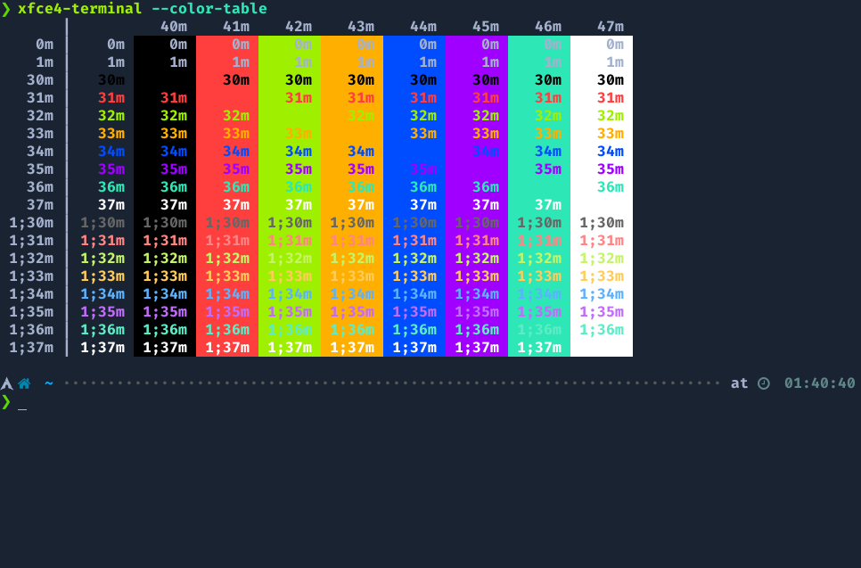

# HackTheBox for xfce4-terminal




## Install

```
git clone https://github.com/Gxnon/xfce4-hackthebox
cd xfce4-hackthebox
mv hackthebox.theme ~/.local/share/xfce4/terminal/colorschemes
```
------

Color scheme inspired in [HackTheBox](https://github.com/silofy/hackthebox)